# UniJourney UX overhaul: decision log (September 2026)

- **Branch:** `ux-overhaul-2026-09`, local only.
- **Deploy status:** not deployed. The live Fly app is unchanged.
- **Source:** the supplied copy in `~/Downloads/unijourney-main-2` is identical to the git checkout in `~/Downloads/unijourney`, apart from `PUBLIC_URL.txt`. All work was done in the git checkout.

## 1. Audit (impeccable critique)

**Method:** two isolated reviews.
- Assessment A: a design review in the browser at 375, 768, 1024 and 1440 px, in English and Arabic, dark and light, as the student (Sara) and security (Abdullah) personas.
- Assessment B: the impeccable CLI detector, plus a headless matrix at 320, 375, 768, 1024 and 1440 px with overflow, bottom-bar, truncation and axe checks, plus the in-page detector.

**Heuristic score before:** 26/40.

| Heuristic | Score |
|---|---|
| Visibility of system status | 3 |
| Match with the real world | 3 |
| User control and freedom | 3 |
| Consistency and standards | 2 |
| Error prevention | 3 |
| Recognition rather than recall | 2 |
| Flexibility and efficiency | 2 |
| Aesthetic and minimalist design | 2 |
| Error recovery | 3 |
| Help and documentation | 3 |

**Detector:** the CLI found one finding, `border-accent-on-rounded` on the student ID card. It is a deliberate gold edge, low severity, and was left as is. The in-page detector found:
- Inbox rows truncated by up to 211 px on Today.
- A "first viewport column" overflow on Community, where the rail was not sticky.

### What the reviews found, and what changed

| Earlier lead | State before | Now |
|---|---|---|
| Today feels cramped | Reproduced at 1024 and 375 px. Two hiring emails both truncated to "Review hiring …". | Fixed (§3) |
| Attendance list too long | Reproduced. Phone page 2807 px tall; the free-text resolver came first; five nested scrollers. | Fixed (§6) |
| Prerequisite map tall and noisy | Reproduced. An 816 × 752 window onto a 1936 × 1403 canvas, with every edge drawn. | Fixed (§5) |
| Phone horizontal overflow | Not reproduced on any route in either language. | Still 0 px everywhere |
| Degree audit inside Degree plan | Reproduced. | Moved to its own page (§5) |
| Humanities vs major electives | Partly separated in the audit; plan slots were dead ends. | Separated in the model and the UI, with in-place choice (§5) |
| Map "recenter" acting like zoom-out | Reproduced. | Replaced by an honest "Whole campus" control (§8) |
| Long native From/To selects | Reproduced: 51 options, no groups. | Searchable grouped picker (§8) |
| Community rail not sticky | Reproduced. After a 2500 px scroll, "Coming up" sat at −2242 px. | Sticky (§9) |
| Club posts without media | Reproduced: 0 images in 28 feed posts. | Media model plus attributed highlights (§9) |
| Security sees student navigation | Reproduced: 15 side-menu links and student account items. | Role matrix (§2) |
| Portfolio has no section navigator | Reproduced: 3501 px at 1440, 7449 px at 375. | Sticky navigator (§10) |
| Opportunities don't explain themselves | Partly: an unlabelled 68/65/53 ring. | Fit in words, reasons and evidence (§10) |

The critique would normally end with questions for you. They were skipped because the brief asked for end-to-end implementation.

## 2. Role and route matrix

`shared/access.ts` is the single source for the side menu, phone bottom bar, account menu, Today's tools, the landing page, the client route guard and the server endpoint guards. Mixed roles get the union of their capabilities.

| Capability | Student | Applicant | Security | Reviewer | Registrar | Admissions | Club lead (adds) | Operator |
|---|---|---|---|---|---|---|---|---|
| Today, calendar, approvals | ✓ | Today, approvals | ✓ | ✓ | ✓ | ✓ | | ✓ |
| Academics, degree plan, registration, attendance, study planner, GPA | ✓ | | | | | | | |
| Prerequisite chains | ✓ | ✓ | | ✓ | ✓ | ✓ | | |
| Resources, community, portfolio, career, competitions | ✓ | | | | | | | |
| Campus life (clubs, events) | ✓ | | | | | | ✓ | |
| Campus map | ✓ | ✓ | ✓ | ✓ | ✓ | ✓ | | ✓ |
| Lost & found | ✓ | | ✓ | | | | | |
| Journey | ✓ | ✓ | | | | | | |
| Feedback (rate courses, ask for help) | ✓ | ✓ | | | | | | |
| Course and instructor KPI pages | ✓ | | | ✓ | ✓ | | | |
| Student card | ✓ | | | | | | | |
| Staff desk | | | ✓ | ✓ | ✓ | ✓ | ✓ | |

**Where each persona lands:** applicants land on `/journey`; everyone else lands on `/today`.

**Phone bottom bar:**
- Students: Today · Academics · Campus · Map · Career.
- Staff-only personas: Today · Desk · Map (· Lost & found for security).
- Applicants: Today · Journey · Map · Prereqs.

**Route guard:**
- Opening a page your role can't use shows "Not available for your role", with a link to your start page and, in the demo, "Switch persona".
- Switching persona while on such a page moves you to the new persona's start page.
- On the server, `gate(cap)` returns 403 for the same routes, so hiding a link is never the only protection.

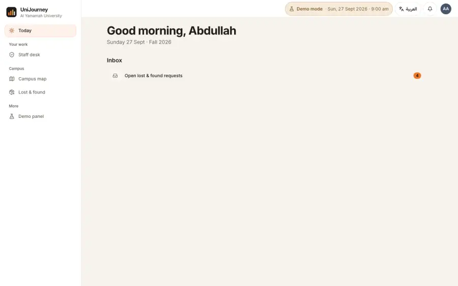 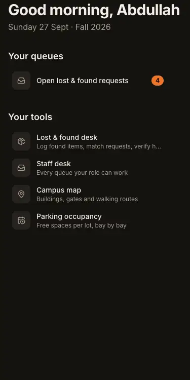

## 3. Today

**Layout:**
- **Phones:** one column, schedule first.
- **Tablets:** the schedule across the top, with inbox and "For you" side by side below it.
- **1280 px and up:** the day on the left, what needs you on the right.

**Rows:**
- Inbox titles wrap to two lines, with the full text on hover.
- Hiring emails lead with their subject.
- Staff and applicants get "Your tools" (desk, lost & found, map, parking or programmes) instead of a nearly empty page.

**Checked at:** 320, 375, 768, 1024 and 1440 px, in both directions and both themes, with 0 px overflow.

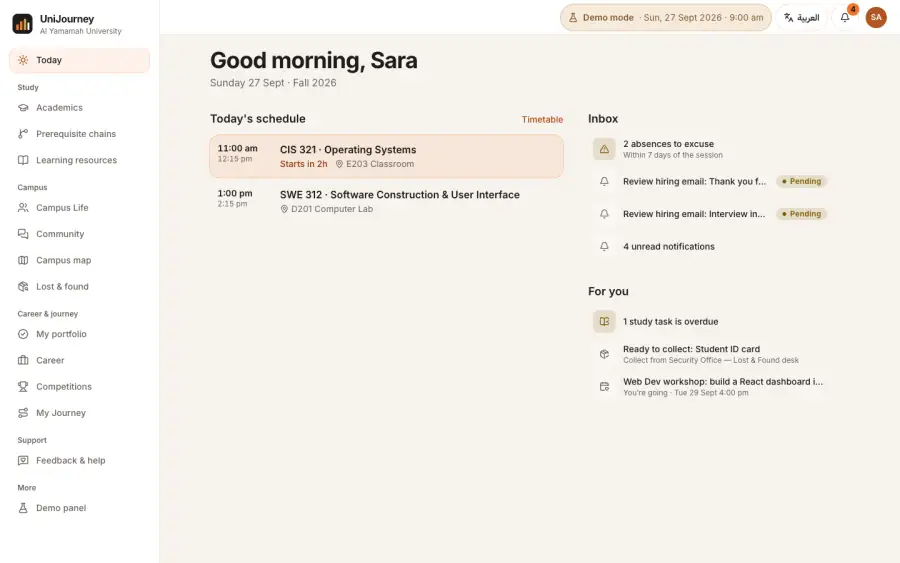 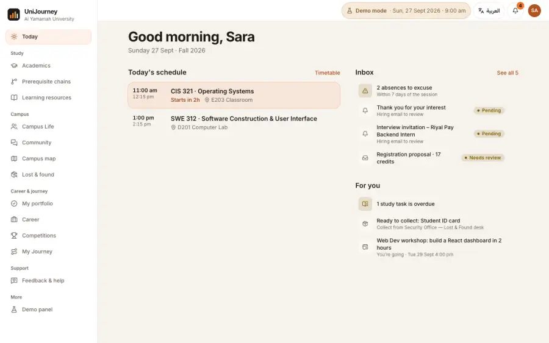

## 4. GPA planner (`/academics/gpa`)

**Grade policy** (`shared/gpa.ts`, used by the planner, the portfolio and career matching):

| Letter | Marks | Points |
|---|---|---|
| A+ | 95–100 | 4 |
| A | 90–94 | 3.75 |
| B+ | 85–89 | 3.5 |
| B | 80–84 | 3 |
| C+ | 75–79 | 2.5 |
| C | 70–74 | 2 |
| D+ | 65–69 | 1.5 |
| D | 60–64 | 1 |
| F | below 60 | 0 |

- **Source:** YU Examinations Policy & Procedures V3.0, effective 9 July 2023, p. 3.
- **Repeats:** every attempt counts, per the Academic Progress policy V6.3 (effective 21 May 2025).
- **Assumptions, labelled as such:** rounding to two decimals, and DN counted as F.

**Demo transcript letters:** the demo transcript used an A/A− scale that YU does not have. The `grades-yu-scale-v1` migration relabels A → A+ and A− → A with identical grade points, so no GPA changes.

**Three separate figures:**
- **Official:** from the transcript, read-only.
- **This term:** an estimate.
- **Forecast:** a what-if.

**This term:**
- Assessments with a type, a weight, and either earned/max or a percentage.
- Reorder, remove, or start from a common split as an example.
- A manual final grade, and pass/fail.
- An assumption for work not graded yet.
- The mark needed on the rest to reach a target letter.
- Weights over 100 % are flagged as impossible; weights under 100 % as incomplete.
- Missing grades are never counted as zero.

**Future semesters:**
- Named scenarios: new, duplicate, reset, delete.
- Courses carry credits, an expected grade, pass/fail and "repeats course X".

**Targets:**
- Excellence Scholarship categories: 50 % at 3.75, 40 % at 3.50, 30 % at 3.30. The source link and checked date are shown, and the page notes the PDF has no effective date.
- Dean's Honors List at 3.60, or a custom target.
- The required average, the achievable range and the remaining degree credits.
- A one-time, dismissible note says on track, close to target or below target. It gives the exact projection and what it is based on, and states it is a planning indicator, not a decision.

**Storage and privacy:**
- Saved automatically as a private, versioned document per student.
- A stale tab gets a 409 instead of overwriting.
- "Delete my GPA planning data" is available.

**Tests:** `tests/gpa.test.ts` (19 tests) covers the scale, exclusions, missing grades, repeats, rounding boundaries, weights, required averages, target boundaries, the migration and the API.

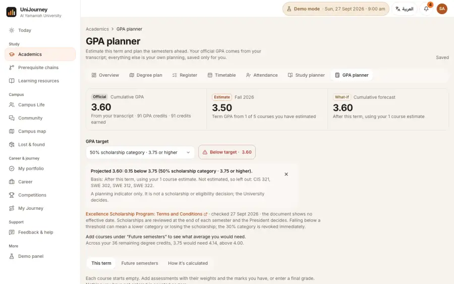

## 5. Degree plan, graduation requirements and prerequisites

**Degree plan:**
- "Degree plan & audit" is now "Degree plan". The audit tab and the duplicate graph tab are gone.
- The audit data lives on `/academics/requirements` ("Graduation requirements"). Next-term options there are grouped into core/major, humanities electives and major electives.
- The plan is grouped by year, finished years collapse, and the current year is marked. Details open under the course.
- Elective slots are dashed and labelled "Humanities elective" or "Major elective" (`elective_kind` in the plan API).
- A slot opens its options in place, with status and reasons, and "Add to next term's basket" when eligible.

**Prerequisite chains:**
- No edges are drawn until a course is chosen.
- Then only its direct prerequisites and immediate unlocks appear, with arrows, plus a "Full chain (n before · m after)" control.
- Related courses carry text tags, so colour is not the only signal.
- The details spell out "all of" and "one of".
- A list view is the default on phones and suits screen readers.
- The map sizes to its content, and `?course=` deep links work.

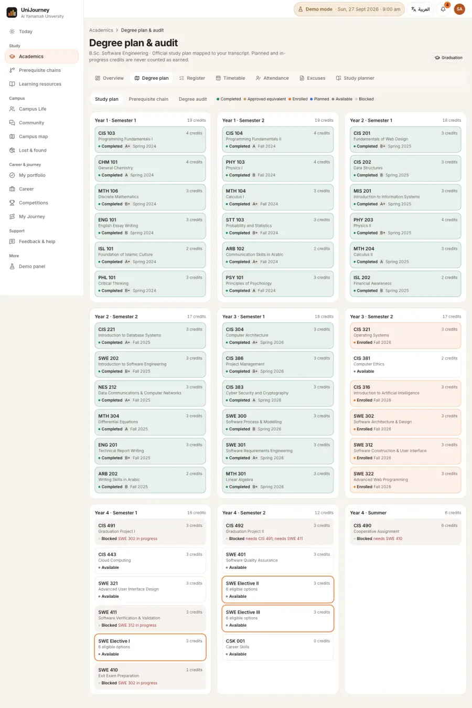 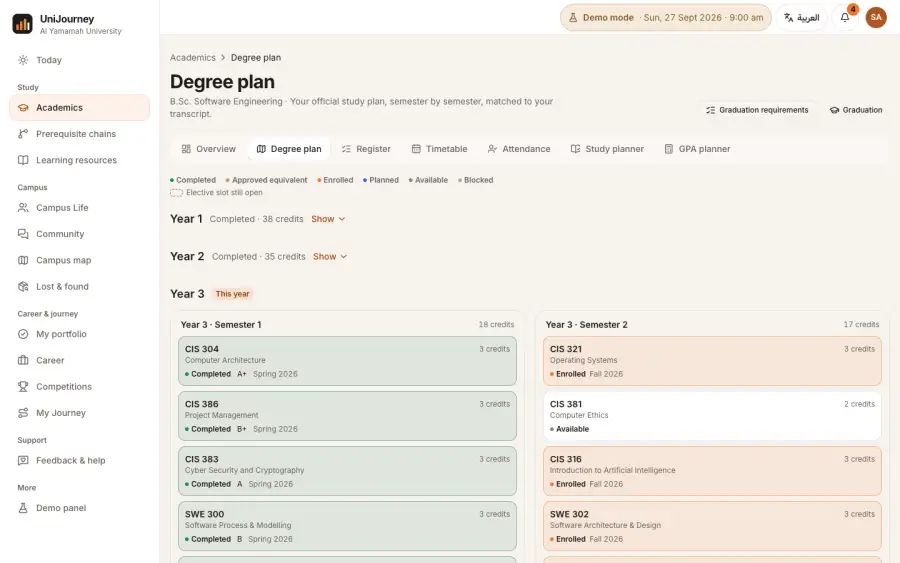
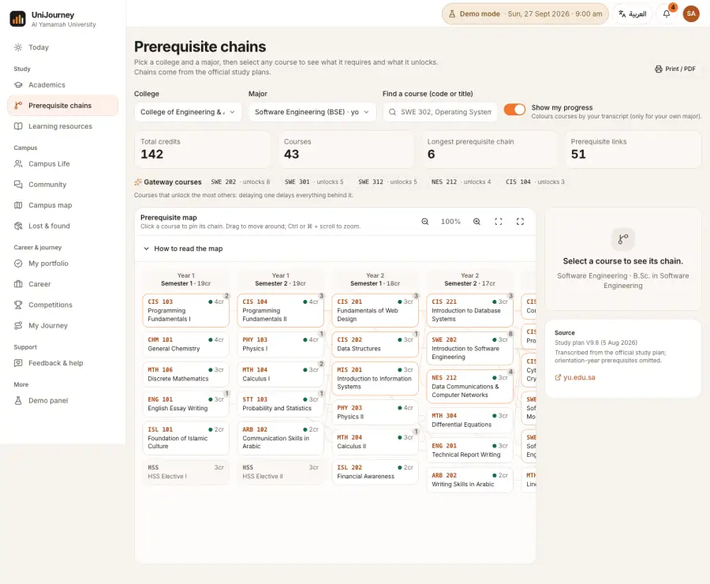 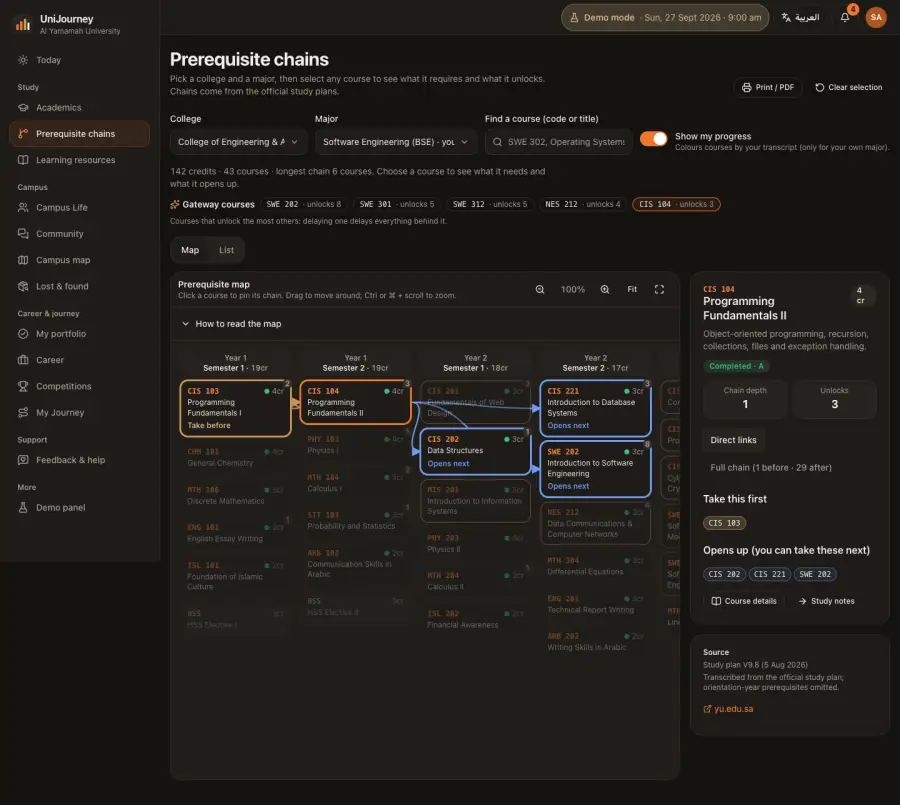

## 6. Attendance

- Absences you can still excuse come first, soonest deadline first, each with one next step.
- Then excuses under review, then absences past the window (folded away).
- "Find a session" says what it searches.
- Each course shows its percentage against the thresholds, labelled as demo values rather than YU policy.
- Session history sits behind a disclosure, with Missed / Excused / All filters.
- `?session=` deep links still highlight the row.
- The attendance API now returns the demo-clock date.
- Phone page height went from 2807 px to 2072 px.

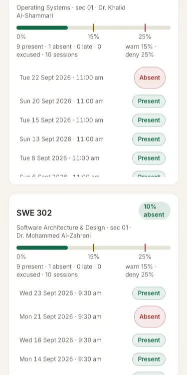 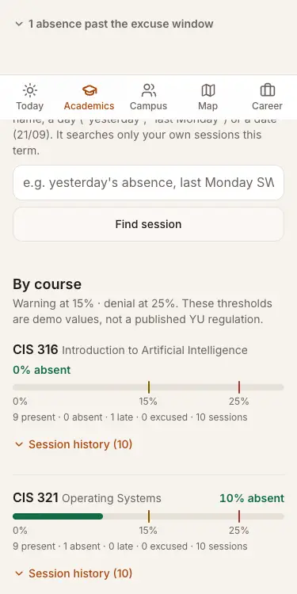

## 7. Registration: comparing sections and classmates

**Compare sections:**
- Read-only, side by side.
- Shows seats with the time checked, clashes, travel, campus, credit total, prerequisites and how the week moves.
- "Switch" is a same-course swap with a confirmation. It clears the approval and offers Undo.

**Classmates:**
- Connect only through a one-time code given in person. You see whose code it is before linking; the code is single-use and expires after 7 days.
- Each student chooses which basket courses to share; nothing is shared by default.
- A suggested section is never a seat reservation.
- Accepting a suggestion re-checks the connection, the basket revision (409 if stale), the seats (409 if full), and conflicts, credits, campus and prerequisites (422). It then changes only the accepting student's plan and invalidates their approval.
- Either student can end the connection.

**Tests:** `tests/academics.peers.test.ts` (8 tests).

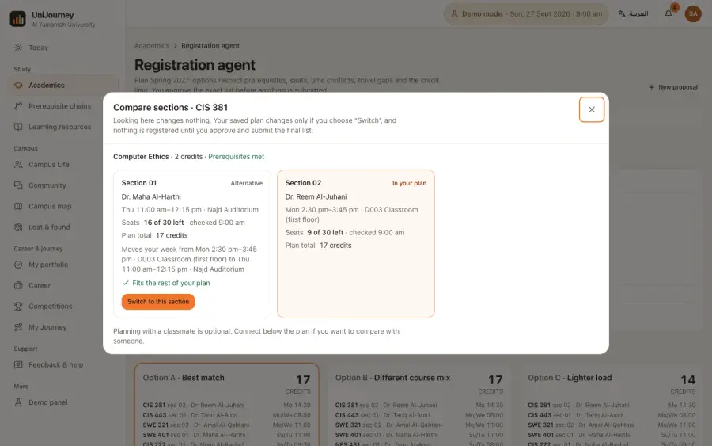

## 8. Campus map

- The unlabelled Maximize2 "recenter" button is replaced by a visible "Whole campus" control.
- From and To are searchable comboboxes with shortcuts (my location, my next class), recent places, popular places, then building → floor → room.
- Full names wrap, the keyboard works, and there is a clear no-result state.
- The pickers stay in sync with the pins and the URL.

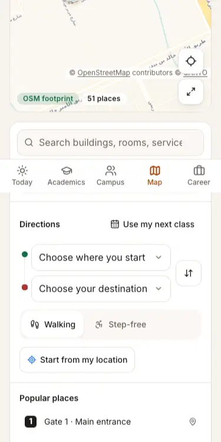 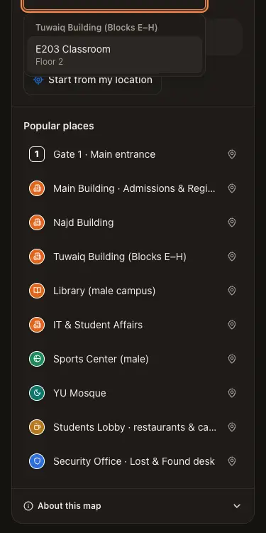

## 9. Community and club media

**Rail:** sticky under the header on wide screens, capped to the viewport. After a 2500 px scroll it sits at top 72 px and bottom 884 px.

**Media model:**
- An upload or a curated asset, with size (no layout shift), alt text, caption and credit; up to four per post.
- Leads upload images with required alt text.
- Uploaded images are readable by whoever can see the post.

**Highlights:** four verified past highlights with links, dates and illustrations. See `docs/research/COMMUNITY-MEDIA.md`.

**Tests:** `tests/campus.media.test.ts`.

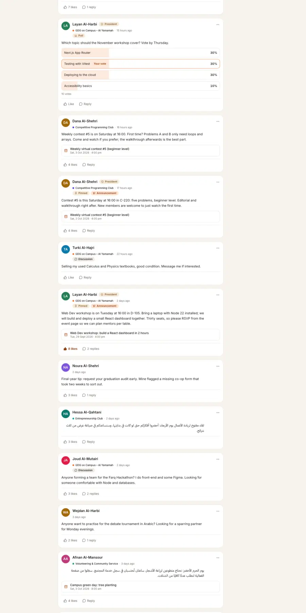 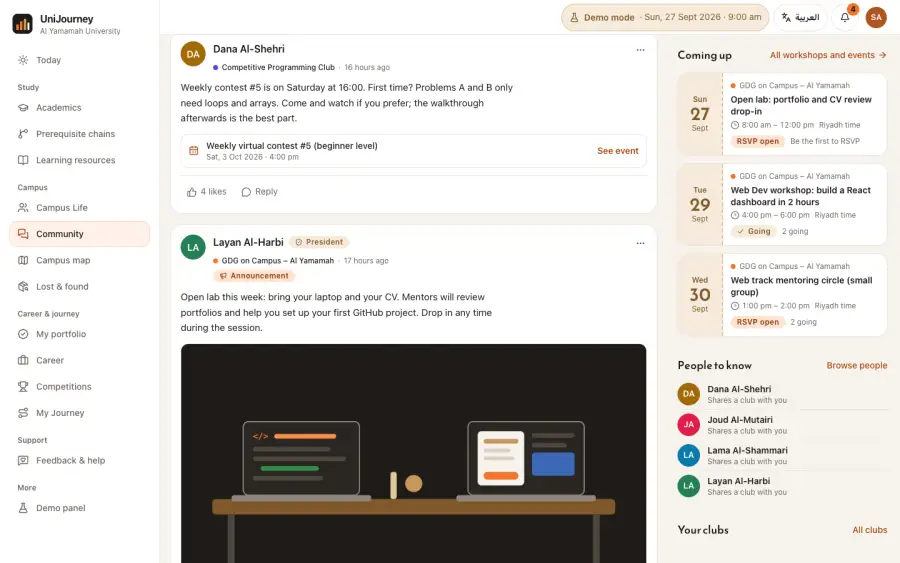

## 10. Portfolio and opportunities

**Page:**
- A sticky section navigator marks the section in view.
- One column, with account, import, privacy and CV tools grouped at the end.
- "Next steps" replace the ring and badge wall.
- Skills are split into "shown in your work" and "self-declared only".

**Entries:**
- Labels and examples fit the kind of entry.
- Location and outcomes fields.
- Inline validation, visibility explained, a live preview, and move up/down.
- LinkedIn imports stay private until reviewed.

**Opportunities:**
- Fit in words ("Strong fit", "Good fit", "Worth a look") instead of a score.
- Each shows why it matches, your evidence, skills listed but not shown, what's missing, eligibility or "not confirmed", source and one next action.
- A note shows which recommendations changed after an edit.

**Tests:** `tests/career.portfolio-edit.test.ts`.

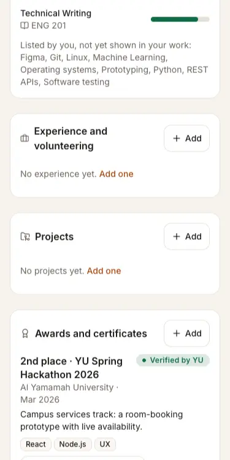 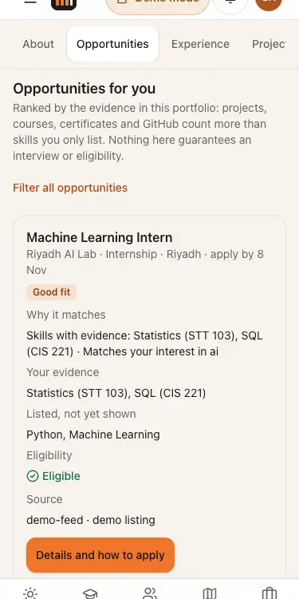

## 11. Final checks

- `npm run typecheck`: clean (server and client).
- `npm test`: 29 files, 251 tests, all passing.
- `npm run build`: builds.
- **Impeccable detector** on every changed UI file: `[]`, no findings.
- **Headless matrix with axe:** 10 changed routes × 8 combinations of 375/1440 px, light/dark and EN/AR, all clean. Horizontal overflow is 0 px everywhere, with one h1 per route and no heading skips.
  - The register page's `WeekGrid` scroll region was not keyboard-focusable. It only shows once a basket exists; it now has `role="region"` and `tabIndex`.
- **Security persona:** Today shows queues and tools. `/academics/plan` and `/portfolio` show "Not available for your role" in both languages. The server returns 403 for academics, GPA, peers and career data.

## 12. Remaining limitations

- **Not deployed or pushed.** Live and GitHub are unchanged. When deployed, the migrations (`grades-yu-scale-v1`, `club-media-v1`) run once without a reseed.
- **GPA:** rounding and "DN counts as F" are assumptions. Graduation-GPA rules conflict between YU pages and are not modelled.
- **Classmates:** there is no directory by design, so connecting needs a code shared in person. Suggestions only cover courses both students share.
- **Club photos:** the highlights use illustrations. Real photos need the clubs' permission and would come in through the upload flow.
- **Some Arabic gaps remain from before:** a few server-built strings (for example route accessibility notes and some match explanations) are still in English.
- **Tap targets:** the existing switch toggles on the portfolio privacy card measure 44 × 24 px. Their label row is the tap target.
